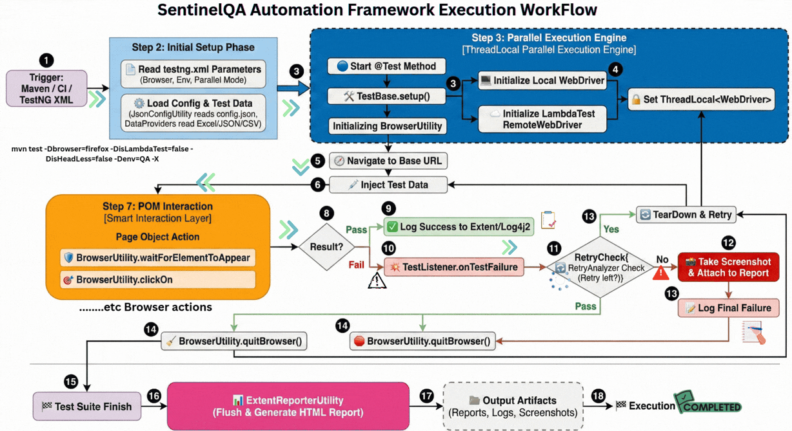
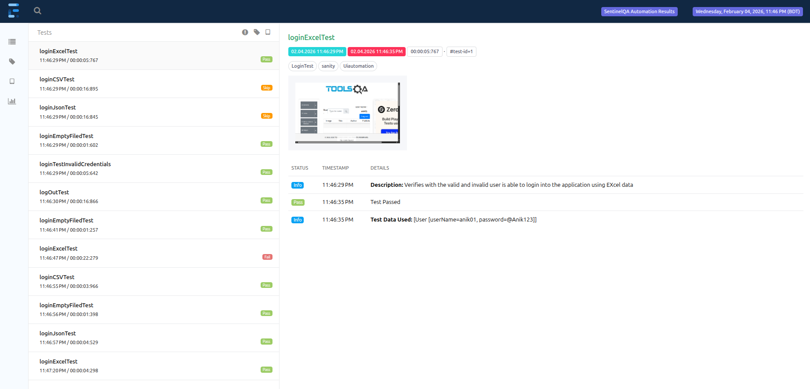
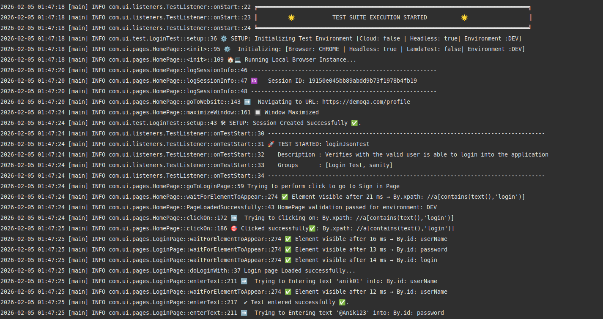
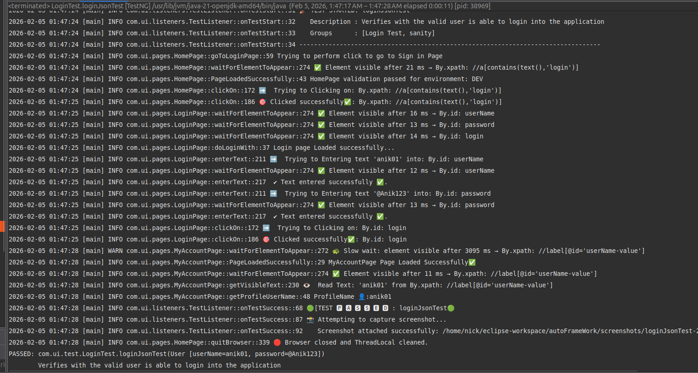
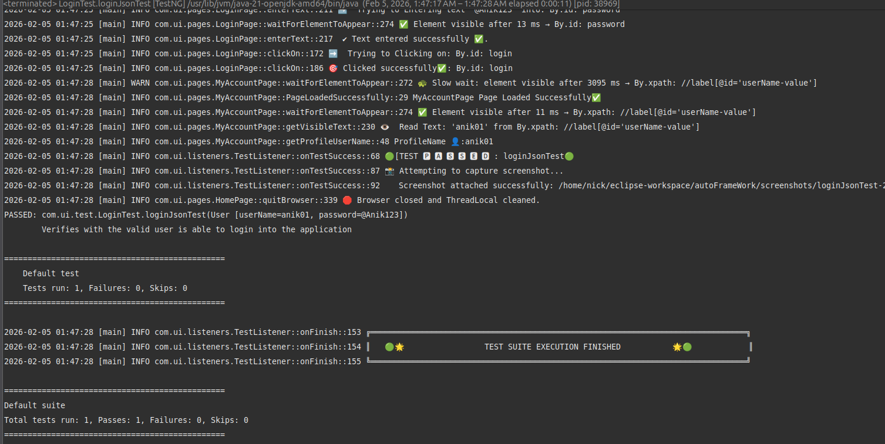

# 🛡️ SentinelQA Automation Framework  


<br>


## Enterprise-Grade Hybrid Test Automation System
---

## 📖 Table of Contents
1. [Project Overview](#1-project-overview)
2. [Core Technologies & Tools](#2-core-technologies--tools)
3. [Framework Architecture](#3-framework-architecture)
4. [Key Technical Features](#4-key-technical-features)
5. [Resilience & Self-Healing](#5-resilience--self-healing)
6. [Framework Structure](#6-framework-structure)
7. [Prerequisites & Setup](#7-prerequisites--setup)
8. [Execution Guide](#8-execution-guide)
9. [Reporting & Logs](#9-reporting--logs)
10. [Future Roadmap](#10-future-roadmap)
11. [Contact](#11-contact)
12. [Project Execution Video](#project-execution-video)


---

## 1. Project Overview
**SentinelQA** is a high-performance, thread-safe automation framework engineered to handle the complexities of modern web applications like **DemoQA**. It bridges the gap between manual testing and continuous deployment by providing a resilient, data-driven, and self-healing execution engine.

### 💡 Core Philosophy
- **Maintainability**: Locators are strictly isolated from test logic using the Page Object Model (POM).  
- **Scalability**: Run 1 or 1,000 tests in parallel with zero session leakage via `ThreadLocal`.  
- **Observability**: Every action is logged via **Log4j2**, and every failure is captured visually via **Extent Reports**.  
- **Flakiness Mitigation**: Achieved using a custom `RetryAnalyzer` and intelligent **Explicit Waits**.  

---

## 2. Core Technologies & Tools

| Category | Technology |
|-------|-----------|
| Language | Java 21 |
| Engine | Selenium WebDriver 4.x |
| Test Runner | TestNG 7.x |
| Build Tool | Maven |
| Reporting | ExtentReports 5 (Thread-Safe) |
| Logging | Log4j2 |
| Data Parsing | Apache POI (Excel), Jackson/Gson (JSON), OpenCSV |
| Cloud Integration | LambdaTest |

---

## 3. Framework Architecture
The framework follows a modular **Layered Architecture**. This ensures that:
- UI locator changes do not break test logic  
- Environment shifts do not require code changes  

### 🏛️ The Engine Flow: Thread-Safe Session Management
- **ThreadLocal Isolation**  
  Uses `ThreadLocal<WebDriver>` to ensure that parallel tests remain completely independent in memory. Chrome and Firefox tests can run simultaneously without interference.

- **The Master Constructor**  
  A centralized initialization engine in `BrowserUtility` handles:
  - Cloud execution (LambdaTest)  
  - Local execution  
  - Headless execution  

  This keeps the `TestBase` clean and minimal.

---

## 4. Key Technical Features

### A. Hybrid Data-Driven Testing (DDT)
The framework is agnostic to data sources and supports:

- **Excel (.xlsx)**  
  Using Apache POI with robust handling for numeric cells and empty row filtering.

- **JSON (.json)**  
  Lightweight parsing using Jackson/Gson for POJO mapping.

- **CSV (.csv)**  
  Fast processing for large datasets using OpenCSV.

- **POJO Integration**  
  Maps raw data into Java POJO classes (e.g., `User.java`), preventing the use of magic strings in test logic.

---

### B. Dynamic Environment Switching
- **JSON-Based Configuration**  
  URLs are not hardcoded. The framework reads from `config.json`.  
  Switching environments (DEV / QA / UAT) requires changing only a single word in `testng.xml`.

- **Static Timeout Management**  
  Global synchronization timeouts are defined once during initialization and shared across all Page Objects.

---

### C. Advanced Driver Management
- **Environment Agnostic**  
  Fully parameterized using Maven CLI and TestNG XML.

- **Singleton Design Pattern**  
  Implemented in utilities such as `LoggerUtility` to ensure centralized and efficient resource management.

---

## 5. Resilience & Self-Healing

### 🛡️ Self-Healing Mechanism
The `findElementWithHealing` method is a standout feature of SentinelQA.

- **Impact**  
  Automatically catches `StaleElementReferenceException` and retries element location twice before failing.  
  This effectively handles micro-refreshes common in modern React and Angular applications.

---

### 🎯 Smart-Click Logic
Every click sequence includes:
- Automatic scrolling to bring the element into view  
- Explicit waits to ensure clickability  
- JavaScript fallback click if the standard click is intercepted by overlays  

---

### 🔄 Automated Retry Mechanism
- Implemented using `IRetryAnalyzer`
- Automatically re-runs failed tests (e.g., up to 3 times)
- Handles network instability and flaky UI behavior

---

## 6. Framework Structure

| Directory / Package | Description |
|-------------------|-------------|
| `src/test/java/.../pages` | Page Objects (POM): Separation of object repository and test logic |
| `src/test/java/.../test` | Test Scripts: Business logic and assertions |
| `src/test/java/.../utility` | Utilities: Drivers, Excel/JSON readers, property utilities |
| `config/` | Stores `config.json` for environment management |
| `testData/` | Central hub for Excel, JSON, and CSV test data |
| `reports/` | Destination for ExtentReports 5 HTML dashboards |

---

## 7. Prerequisites & Setup

### Prerequisites
- Java JDK 21 or higher  
- Maven 3.9.x or higher  
- IDE (Eclipse or IntelliJ)  
- *(Optional)* LambdaTest account for cloud execution  

---

### Setup Steps

1. **Clone the Repository**
   ```bash
   git clone https://github.com/MD-Muhiuddin/-sentinel-qa-framework.git
   ```
2. Import Project
   Import as an Existing Maven Project in your IDE.

3. Install Dependencies

  mvn clean install -DskipTests


4. Configure Environment
   Update config/config.json with your URLs and credentials.

   demo:

   ```json
    {
    "environments": {
        "DEV": {
        "url": "https://demoqa.com/profile",
        "username": "dev_user",
        "password": "dev_password_123",
        "timeout": 10,
        "MAX_NUMBER_OF_ATTEMPTS": 3
        },
        "QA": {
        "url": "https://qa-demoqa.com/profile",
        "username": "qa_user",
        "password": "qa_password_456",
        "timeout": 20,
        "MAX_NUMBER_OF_ATTEMPTS": 5
        }
    }
    }

## 8. Execution Guide
### Option 1
 1. Right click on testng.xml
 2. Run as TestNG Suite

### Option 2
1. Standard Run

```bash 
    mvn test
```

2. Custom Run(Pverride Parameters)
```bash
# Run on QA, Firefox, Headless
mvn test -Dbrowser=firefox  -DisHeadLess=true -Denv=QA -X

# Run on  DEV, Chrome, Headless
mvn test -Dbrowser=Chrome  -DisHeadLess=true -Denv=QA -X

# Run on Cloud (LambdaTest)
mvn test -Dbrowser=chrome -DisLambdaTest=true -Denv=qa -X
```

## 9. Reporting & Logs
### ExtentReports 5
* reports/SentinelQA_Report.html
<br>

<br>
Interactive dashboard with pie charts and step-by-step execution logs.

### Failure Traceability
* Automatically captures and embeds screenshots at the exact moment of failure.

### Log4j2 Logs
* logs/application.log
Detailed logs with Thread IDs for easier debuggin





## 10. Future Roadmap

 * CI/CD Integration: Jenkinsfile for automated pipeline execution

 * Trello API Bridge: Trigger test methods from Trello To-Do cards

 * Dockerization: Containerized execution environment

 * AI Integration: AI-assisted Page Object generation


## 11. Contact
Lead Engineer: MD Muhiuddin

Specialization: SQA Engineer | Software Quality Assurance

🛡️ SentinelQA: Ensuring good quality software development processes with DevOps best practices.

## 12. Project Exetution Video
  * Yourtube Link 
